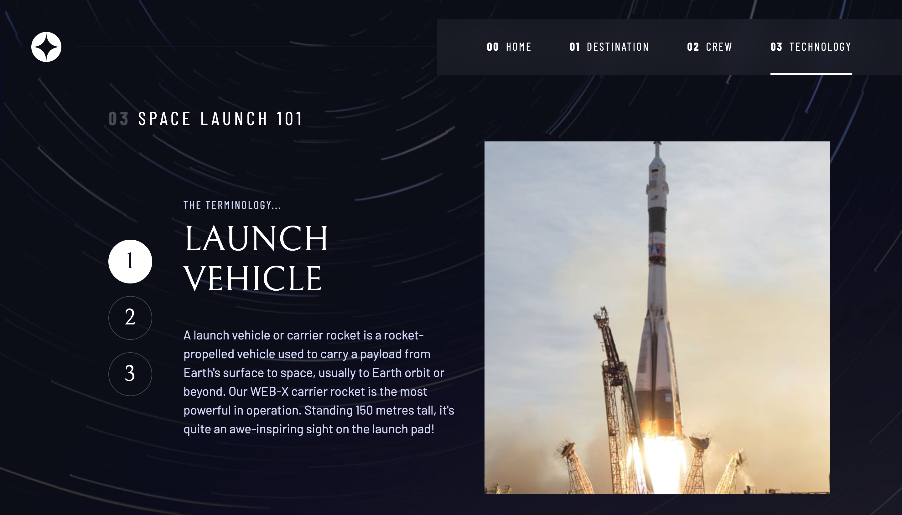

# Frontend Mentor - Space tourism website solution

This is a solution to the [Space tourism website challenge on Frontend Mentor](https://www.frontendmentor.io/challenges/space-tourism-multipage-website-gRWj1URZ3). Frontend Mentor challenges help you improve your coding skills by building realistic projects.

## Table of contents

- [Overview](#overview)
  - [The challenge](#the-challenge)
  - [Screenshot](#screenshot)
  - [Links](#links)
- [My process](#my-process)
  - [Built with](#built-with)
  - [What I learned](#what-i-learned)
  - [Continued development](#continued-development)
  - [Useful resources](#useful-resources)
- [Author](#author)
- [Acknowledgments](#acknowledgments)

## Overview

### The challenge

Users should be able to:

- View the optimal layout for each of the website's pages depending on their device's screen size
- See hover states for all interactive elements on the page
- View each page and be able to toggle between the tabs to see new information

### Screenshot

<table>
  <tr>
    <td>
      
      
    </td>
  </tr>
  <tr>
    <td>
      
    </td>
  </tr>
  <tr>
    <td>
      
    </td>
  </tr>
  <tr>
    <td>
      
    </td>
  </tr>
  <tr>
    <td>
    
    </td>
  </tr>
</table>

### Links

- Solution URL: [here](https://your-solution-url.com)
- Live Site URL: [here](https://zun-liang.github.io/fem-space-tourism/)

## My process

### Built with

- Semantic HTML5 markup
- CSS custom properties
- Flexbox
- CSS Grid
- Mobile-first workflow
- TypeScript
- [React](https://reactjs.org/) - JS library
- [Styled Components](https://styled-components.com/) - For styles
- [React Router](https://reactrouter.com/en/main)
- [Vite](https://vitejs.dev/)
- [vite-plugin-svgr](https://www.npmjs.com/package/vite-plugin-svgr)

### What I learned

- How to use Typescript in React, React Router, Styled-Components and Vite
- How to make a slide navigation

### Continued development

### Useful resources

#### HTML Related

- [Window: location property](https://developer.mozilla.org/en-US/docs/Web/API/Window/location)
- [7 Alternatives to the 
 HTML Tag](https://medium.com/@zac_heisey/7-alternatives-to-the-div-html-tag-7c888c7b5036)
- [script: The Script Element](https://developer.mozilla.org/en-US/docs/Web/HTML/Element/script)
  Module script defer by default.
- [Using data attributes](https://developer.mozilla.org/en-US/docs/Learn/HTML/Howto/Use_data_attributes): HTML custom attributes, data-\*

#### CSS Related

- [backdrop-filter](https://developer.mozilla.org/en-US/docs/Web/CSS/backdrop-filter)
- [clamp](https://developer.mozilla.org/en-US/docs/Web/CSS/clamp)
- [place-items](https://developer.mozilla.org/en-US/docs/Web/CSS/place-items)
- [:where()](https://developer.mozilla.org/en-US/docs/Web/CSS/:where)
- [white-space](https://developer.mozilla.org/en-US/docs/Web/CSS/white-space)
- [Character issue with the Bellefair Google font](https://stackoverflow.com/questions/72577560/character-issue-with-the-bellefair-google-font)
- [prefers-reduced-motion](https://developer.mozilla.org/en-US/docs/Web/CSS/@media/prefers-reduced-motion)
- [padding-inline](https://developer.mozilla.org/en-US/docs/Web/CSS/padding-inline)
- [margin-inline](https://developer.mozilla.org/en-US/docs/Web/CSS/margin-inline)
- [subsequent-sibling combinator ~](https://developer.mozilla.org/en-US/docs/Web/CSS/Subsequent-sibling_combinator)
- [next-sibling combinator +](https://developer.mozilla.org/en-US/docs/Web/CSS/Next-sibling_combinator)
- [child combinator >](https://developer.mozilla.org/en-US/docs/Web/CSS/Child_combinator)
- [descendant combinator single space (" ")](https://developer.mozilla.org/en-US/docs/Web/CSS/Descendant_combinator)
- [:where()](https://developer.mozilla.org/en-US/docs/Web/CSS/:where)
- [:is()](https://developer.mozilla.org/en-US/docs/Web/CSS/:is)
- [aria-selected](https://developer.mozilla.org/en-US/docs/Web/Accessibility/ARIA/Attributes/aria-selected)
- [@supports](https://developer.mozilla.org/en-US/docs/Web/CSS/@supports)

#### Typescript Related

- [React Typescript Cheatsheets](https://react-typescript-cheatsheet.netlify.app/)
- [React, passing state setter (useState) to child component with TypeScript](https://stackoverflow.com/questions/72383412/react-passing-state-setter-usestate-to-child-component-with-typescript)
- [How to write the correct type for useLoaderData()? (Typescript) #9792](https://github.com/remix-run/react-router/discussions/9792)

#### Vite Related

- [Static Asset Handling](https://vitejs.dev/guide/assets)

## Author

- Website - [Zun Liang](https://zunldev.com/)
- GitHub - [@zun-liang](https://github.com/zun-liang)
- Frontend Mentor - [@zun-liang](https://www.frontendmentor.io/profile/zun-liang)
- freeCodeCamp - [@zun-liang](https://www.freecodecamp.org/zun-liang)

## Acknowledgments

- [Build a Space Travel Website](https://scrimba.com/learn/spacetravel)

  I learned some pretty cool CSS skills in Kevin Powell's course and utilized some of them in this solution.
